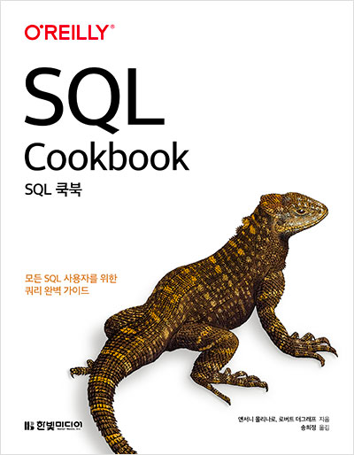
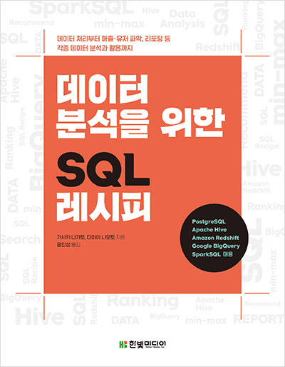

# ✏️ SQL 공부하는 곳 ✏️

    
    

### ⚙️ 설정 환경
`PostgreSQL`, `MySQL`, `Oracle` `DataGrip`

### 💻 공부는 Notion 개인 페이지를 통해 정리하였습니다.

 

## "SQL Cookbook"

[Chapter 01. 레코드 검색](https://www.notion.so/moondongmin/Chapter-01-e037896e55ae4b48a06f1b8114970824)

[Chapter 02. 쿼리 결과 정렬](https://www.notion.so/moondongmin/Chapter-02-6af45af617944e6ea36d8aedcbf1fc0a)

[Chapter 03. 다중 테이블 작업](https://www.notion.so/moondongmin/Chapter-03-20827c1765f74925ae0f13c62face274)

[Chapter 04. 삽입, 갱신, 삭제](https://www.notion.so/moondongmin/Chapter-04-796042bd350e425dab1fc8fd5a65ad3d)

[Chapter 05. 메타 데이터 쿼리](https://www.notion.so/moondongmin/Chapter-05-ade05b84f92542e4ac69379b7c882d65)

[Chapter06. 문자열 작업(1)](https://www.notion.so/moondongmin/Chapter06-1-004262f2f2204f469c8b47507d6632eb)

[Chapter06. 문자열 작업(2)](https://www.notion.so/moondongmin/Chapter06-2-83d170935be147ee81584bb598e53d35)

[Chapter 07. 숫자 작업](https://www.notion.so/moondongmin/Chapter-07-48003d4fb1594a7db2e4a7e2fc899516)

[Chapter 08. 날짜 산술](https://www.notion.so/moondongmin/Chapter-08-e35d475175274e4caf0122761def4e46)

[Chapter 09. 날짜 조작 기법(1)](https://www.notion.so/moondongmin/Chapter-09-f44cca3df7c4462f960fb9c711baaf96)

[Chapter 09. 날짜 조작 기법(2)](https://www.notion.so/moondongmin/Chapter-09-2-bdac6e95e1d7413b8c383b6bc40b327b)

[Chapter 10. 범위 관련 작업하기](https://www.notion.so/moondongmin/Chapter-10-912119a6f0a9497d82bb13222b466043)

[Chapter 11. 고급 검색](https://www.notion.so/moondongmin/Chapter-11-10586d5a1613484e9236f849eac6f614)

[Chapter 12. 보고서 작성과 재구성](https://www.notion.so/moondongmin/Chapter-12-a022890bad01403ea1a41b9d10673500)

[Chapter 13. 계층적 쿼리](https://www.notion.so/moondongmin/Chapter-13-6031e57af61f45abb671b1a2810d77ed)

[Chapter 14. 기타 다양한 기법](https://www.notion.so/moondongmin/Chapter-14-a61f8294ac654dadbf33925aca819154)

[부록 A. 윈도우 함수 살펴보기](https://www.notion.so/moondongmin/A-e0cc02b279474a5d887d4d0b42f737bc)

## "데이터 분석을 위한 SQL 레시피"
[Chapter 03. 데이터 가공을 위한 SQL](https://www.notion.so/moondongmin/Chapter-03-SQL-fd1521c8ab604cb0bba4aad7597139e9)

[Chapter 04. 매출을 파악하기 위한 데이터 추출](https://www.notion.so/moondongmin/Chapter-04-82146b0a425a43b48382992e75cd0fe7)